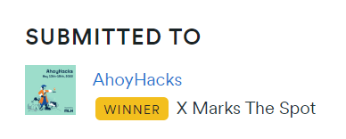
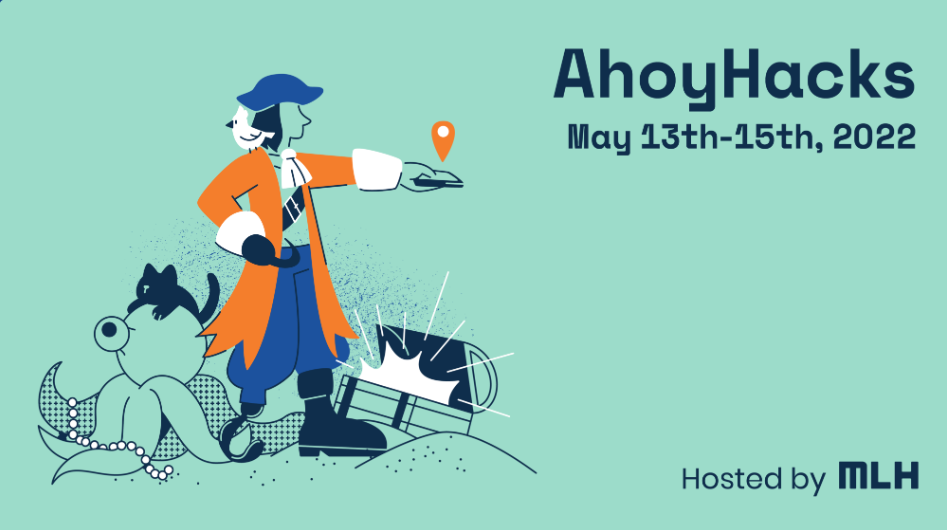

## Winner, Ahoy Hacks 2022
#### "X Marks The Spot" category prize for the best hack built on the theme of the hackathon i.e "Pirates". 
Category Prize awarded - Snapchat Spectacles

Check out the project video here - [YouTube](https://youtu.be/ddZyEROSzJE)

## Inspiration💡
The newly crowned Pirate King, Monkey D. Luffy has set sail in the world to conquer the 4 seas. He sails now towards the grand line to steal the one piece. For non pirates *(Hackers)* we need to find the safest route through the seas to get to our destination wwithout being attacked by their fearsome crew. 

  

## What it does 🧭
We designed an android app with the help of flutter. Once you open the app you are delightfully bought into the world of pirates with an awesome UI. Once in it, you can choose your starting destination and end destination and the map changes to show you the safest route possible to the given destination. 

You will see the world map as per the specifications in the anime one piece, we call this place mapa da one piece. In the day and age where ferocious pirates rule the 4 seas, it is important for us hackers to find a way of travel that can take us to our destination without picking up fights with the mighty pirates.

We designed our mapa da one piece using wonderdraft which is extremely easy o use for noob navigators and cartographers as ourselves,and maped out the world and worked on creating the safe route paths. 

The generated map files were then projected to a globe to give the app an immersive experience that you can see here. You can view the rest of the globe to check other parts of the world. 

Depending on the source and destination entered by the user, the globe changes and shows us the specific route.

We analyzed the entire anime series to plot the seas where pirates are generally known to sail and put them up as a trivia section where you get more details on your journey. Google maps had petrol pumps as stops and we have Baratie, the sea restaurant. 

## How the App Looks 🤜🔥🤛

## How we built it 🔧

Our solution, uses `map to globe` as a method to render our world map of the One Piece world. We built an app using flutter and dart language and made maps using wonderdraft.

## Tech Stack 🔨
1. Flutter
2. Dart
3. Map to Globe
4. Wonderdraft
5. Git
6. GitHub

## Challenges we ran into 🏃‍♂️

1. `Map to Globe` was down for about 24 hours since the start of the hackathon, and looking for alternatives that could suffice our solution was a big challenge. 

## Accomplishments that we're proud of 🏅
1. We made the each and every map using wonderdraft

## What we learned 🧠
1. Learnt wonderdraft 
2. We desgined the map
3. We added those customized maps onto the globe

## What's next ⏭
 1. For future additions we aim to dynamically show the positioning of pirate ships so that we hackers could safely sail away from them.

## Collaborators 🤖

Only developers.
| Name      | GitHub Profile     |
| :------------- | :----------: |
|  Gyanesh Samanta   | [GitHub](https://www.github.com/gyanesh-samanta-123) |
|  Eshaan Bhardwaj   | [GitHub](https://github.com/Eshaan-B) |
|  Chetas Shree Madhusudhan   | [GitHub](https://github.com/ChetasShree) |

 

